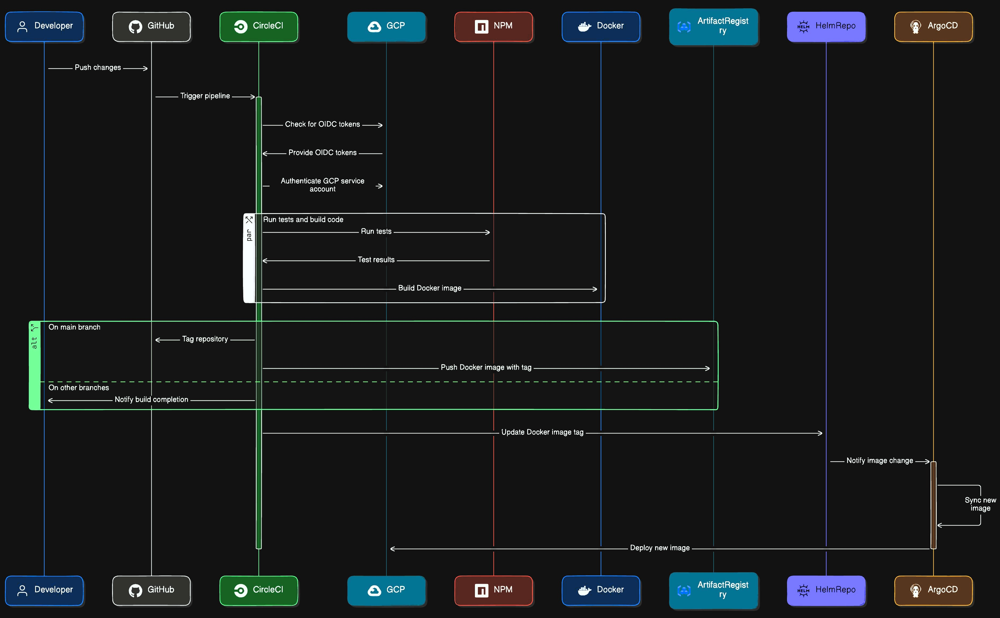

## Continuous Deployment with Helm Charts and ArgoCD
### Overview
Our project utilizes Helm charts and ArgoCD for streamlined and automated deployment of our React.js application. This setup ensures that any changes made to the application code trigger updates to the Helm charts, which are then automatically reconciled by ArgoCD for seamless deployment.

### Helm Charts
Helm is a package manager for Kubernetes that simplifies the deployment and management of applications. We've created Helm charts to package our React.js application for Kubernetes. These charts define the structure and configuration of our application, including its deployment, services, ingress, and other Kubernetes resources.

Whenever changes are made to our application codebase, our CI/CD pipeline updates the Helm charts accordingly. This ensures that the Helm charts accurately reflect the latest version of our application.

### ArgoCD
ArgoCD is a declarative, GitOps continuous delivery tool for Kubernetes. It automates the deployment and synchronization of applications in Kubernetes clusters based on their Git repository definitions. ArgoCD continuously monitors the Git repositories for changes and ensures that the deployed applications match the desired state defined in the Git repository.

We've configured ArgoCD to watch the Helm chart repository containing our application's Helm charts. When changes are detected in the Helm charts, ArgoCD automatically triggers synchronization to update the deployed resources in our Kubernetes cluster. This process ensures that our application is always up-to-date and reflects the latest changes made to the Helm charts.

### Benefits
**Automation**: The integration of Helm charts and ArgoCD automates the deployment process, reducing manual intervention and minimizing the risk of errors.

**Consistency**: By defining our application's deployment configuration in Helm charts and enforcing GitOps principles with ArgoCD, we ensure consistency and reproducibility in our deployments across different environments.

**Continuous Deployment**: With Helm charts and ArgoCD, we achieve continuous deployment, allowing us to rapidly deliver new features and updates to our application while maintaining reliability and stability.

This shopping cart application is based on react js. The CICD pepeline is setup using *circleci* and containerised using *Docker*. 

The helm chart repository can be found [here](https://github.com/prashantsingh34/helm-charts-services)

## Available Scripts

In the project directory, you can run:

### `npm run start`

Runs the app in the development mode.\
Open [http://localhost:3000](http://localhost:3000) to view it in your browser.

The page will reload when you make changes.\
You may also see any lint errors in the console.

### `npm run test`

Launches the test runner in the interactive watch mode.\
See the section about [running tests](https://facebook.github.io/create-react-app/docs/running-tests) for more information.

### `npm run build`

Builds the app for production to the `build` folder.\
It correctly bundles React in production mode and optimizes the build for the best performance.

The build is minified and the filenames include the hashes.\
Your app is ready to be deployed!

See the section about [deployment](https://facebook.github.io/create-react-app/docs/deployment) for more information.

The primary purpose of this project
The CICD pipeline diagrammatic representation  --->

